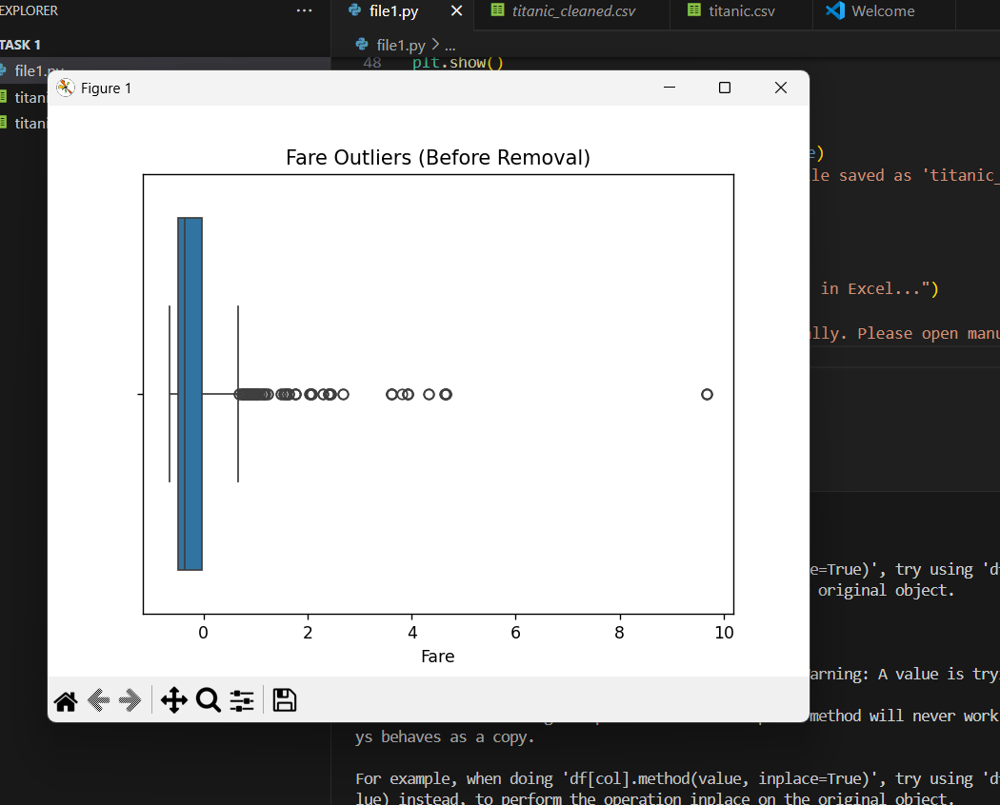
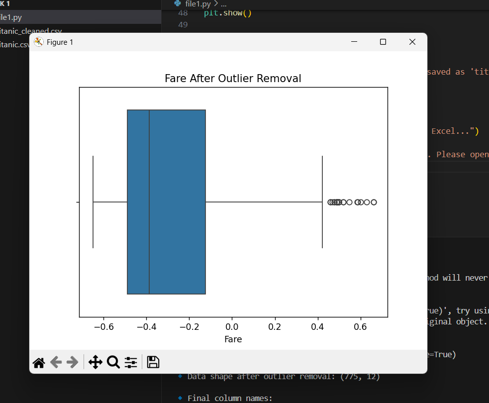

# Titanic Data Cleaning & Preprocessing 🚢📊

This project loads the Titanic dataset (`titanic.csv`), cleans missing values, encodes categorical columns, removes outliers, scales numerical features, and visualizes results using boxplots.

## 📁 Files
- file1.py: Main Python script to clean and visualize Titanic dataset
- titanic.csv: Original dataset (place in same folder)
- titanic_cleaned.csv: Cleaned dataset (auto-generated after running script)
## ▶️ How to Run
 Step-by-step:
1. Clone the repository or download the files.
2. Place `titanic.csv` (original dataset) in the same folder as `file1.py`.
3. Open a terminal or VS Code.
4. Install required packages (only once):
   bash
   pip install pandas numpy matplotlib seaborn scikit-learn
5. Run in terminal with bash as:
   python file1.py
### Result
- boxplot before removing fare outliners:
  
- boxplot after removing fare outliners
  
- you get a folder 'titanic_cleaned.csv'
## what script does:
-Fills missing Age with median
-Fills missing Embarked with mode
-Drops Cabin column (too many missing values)
-Encodes Sex and Embarked as numeric
-Scales Age and Fare (StandardScaler)
-Detects and removes outliers in Fare using IQR
-Shows boxplots before & after
# Titanic_data_cleaning
